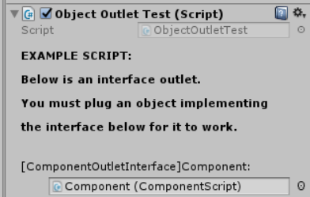

### Implementação de componentes de software em unity
# Unity Interface Outlets

#### Author: Ricardo Zaideman Charf
#### RA: 151238
Esse repositório, [https://github.com/barleto/UnitySoftwareComponents](https://github.com/barleto/UnitySoftwareComponents), é resultado de um estudo feito para a disciplina MC032 - Estudo Dirigídos, do Instituto de Computação, UNICAMP, Brasil, primeiro semestre de 2017.

## Descrição
Esse repositório contém um plugin com uma Implementação de Componentes de software para Unity3D, incluindo um diretório com um arquivo `UnityPackage` para facilitar sua instalção.
As instruções de instalação/uso se encontram [aqui](#instuctions).
Ao clonar o repositório e abrir a cena `cenateste.unity` é possível encontrar um exemplo do plugin funcionando.

## Racional
A IDE e motor de jogos Unity3D é muito famosa e muito usada, seja na industria de jogos (seu foco principal), mas também em outras áreas, como desenvolvimento de aplicativos mobile, já que seu suporte multiplataforma é bastante conciso e maduro. Infelizmente, na versão atual da plataforma (5.4.3), não existe uma forma padrão para a distribuição de software específico para Unity que seja de fácil integração e utilização, por não existir uma interface comum para a estrutura desse tipo de software.

## Resultado
Com isso em mente e como parte de um estudo, foi desnvolvido um pequeno plugin para o editor Unity, chamado `Unity Interface Outlets`. Com o intúito de criar uma interface de _componentes de software_ que possa ser fácilmente integrada ao Unity, para facilitar a troca de código entre desenvolvedores melhorando a forma de como as partes do código se relacionam, aproveitando o melhor que o Unity tem a ofercer: O sistema de scripting de editor e o sistema de packaging do Unity3D, que nos permite criar extensões para adicionar novas funcionalidades e fácilmente instalá-las e compartilhá-las.

O plugin `Unity Interface Outlets`, não foi desenvolvido com o intuito de resolver sozinho as questões citadas no racional. Mas sim, fornecer um software que pretende ajudar a achar uma solução, provendo uma camada de abstração para a implementação do paradigma de componentes de software que, no estudo feito, pareceu ser um caminho viável para a solução desses problemas.

<a name="instuctions"></a>
## Instalação do plugin
Para instalar o plugin, basta abrir o `Unity Package` disponível nesse repositório, que se encontra em [Interface Outlet Download](https://github.com/barleto/UnitySoftwareComponents/raw/master/Assets/Unity%20Package/Unity_Interface_Outlet.unitypackage).

## Utilização

#### Criando uma interface de componente:
Primeiramente, crie a interface que servirá de protocolo para comunicação entre software e componente:


```c#
public interface ComponentInterface
{
    void anInterfaceMethod();
}
```

#### Adicionando um InterfaceOutlet à uma classe:

Em uma novo script `MonoBehaviour`(ou em um já existente), crie uma propriedade do tipo `UnityEngine.Object`, com o attributo `[InterfaceOutletAttribute(Type interfaceType)]`, como no script exemplo abaixo, `ObjectOutletTest.cs`:

```c#
using UnityEngine;
using System.Collections;

public class ObjectOutletTest : MonoBehaviour {

    [Header("EXAMPLE SCRIPT:")]
    [Header("Below is an interface outlet.")]
    [Header("You must plug an object implementing")]
    [Header("the interface below for it to work.")]
    [Header("")]

    //Outlet para componentes com interface do tipo ComponentInterface
    [InterfaceOutlet(typeof(ComponentInterface))]
    public UnityEngine.Object someComponent;

}
```
Perceba que passamos `typeof(ComponentInterface)` para o construtor do atributo `InterfaceOutlet`, assim definindo o tipo da interface que o componente deve implementar para ser posível plugá-lo à este outlet.

**Obs:**O tipo da propriedade criada sempre deve ser `UnityEngine.Object`. Caso contrário, o comportamento é indefinido.

#### Criando um componente:
A criação de componetes é bastante direta: Basta criar um script `MonoBehaviour` que implemente a interface de componente criada anteriormente.

Continuando nosso exemplo, temos o novo componente `ComponentScript.cs`, que exemplifica a implementação de um componente:


```c#
using UnityEngine;
using System.Collections;
using System;

public class ComponentScript : MonoBehaviour, ComponentOutletInterface
{
    //implementação do método da interface
    public void interfaceMethod()
    {
        Debug.Log("Component attachment is working!");
    }
}

```

#### Plugando um componente em um Outlet:

Esse plugin usa as funcionalidades do editor do Unity para facilitar a integração entre software e seu componente.
Por causa do atributo `InterfaceOutlet`, no inspector do Unity, um novo tipo de propriedade irá aparecer, como no exemplo abaixo:



Para integrar o componente basta arrastar um GameObject que tenha um `MonoBehaviour` que implemente a interface requerida. Seguindo o exemplo, arraste um GameObject que tenha o componente `ComponentScript` para a propriedade que representa o _Outlet_, como na figura acima. Com isso, a integração está feita.

#### Utilizando o componente:
Após a integração bem sucedida, é fácil utilizar o componente. Basta chamá-lo utlizando o seguinte template:

```c#
if (component != null) {
    ((ComponentInterface)someComponent).anInterfaceMethod();
}
```

Obs: É necessário checar se a propriedade do componente está nula. Caso esteja, significa que nenhum componente foi plugado ao Outlet.

## Distribuíndo componentes
A distribuição de componentes fica facilitada, já que, para distribuir um componente que foi feito para uma interface específica, basta empacotar todos arquivos e depêndencias desse componente em um `UnityPackage` utilizando o próprio sistema de empacotamento do Unity3D.
